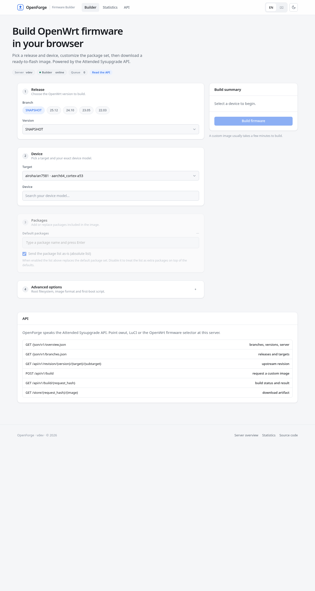
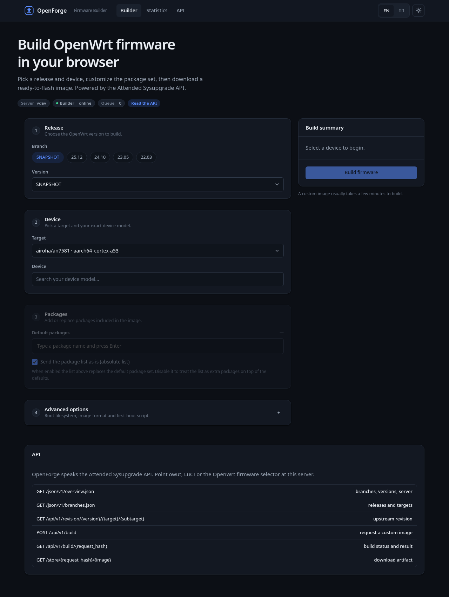
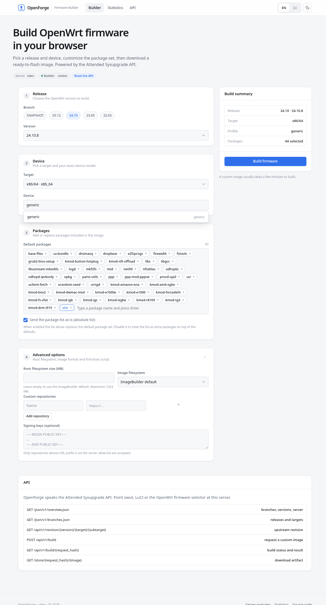
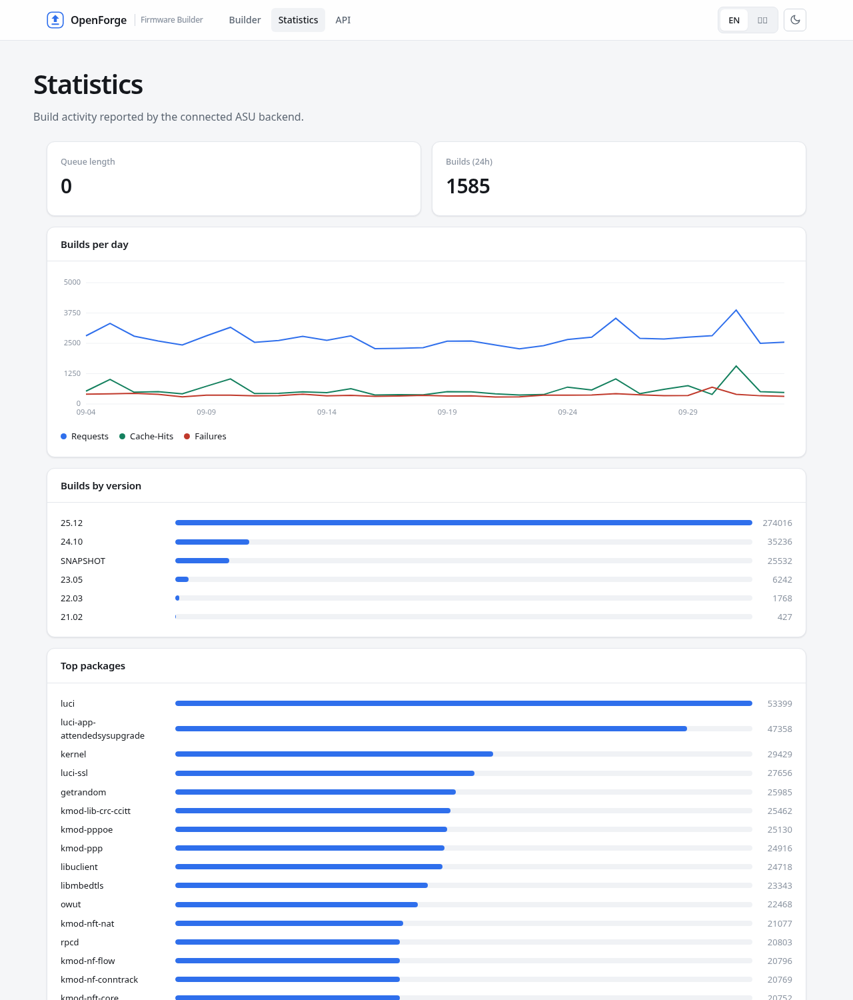

# OpenForge

A modern, self-hostable OpenWrt firmware build server written in Go. OpenForge
**implements the Attended Sysupgrade (ASU) functionality itself** — build
queue, ImageBuilder container orchestration, package handling, result caching
and artifact storage — and ships an **integrated firmware selector** UI on top
of it. It speaks the ASU HTTP API, so existing clients such as `owut`,
`luci-app-attendedsysupgrade` and the OpenWrt firmware selector work unchanged.



<details>
<summary>Dark theme &amp; selection state</summary>





</details>

## What it does

OpenForge is a from-scratch Go port of the ASU server:

- Fetches release metadata (`.versions.json`, `.targets.json`, `profiles.json`,
  package indexes) from `downloads.openwrt.org` and caches it.
- Validates build requests exactly like ASU, including the **byte-for-byte
  request hash** (verified against ASU's own test vectors).
- Runs ImageBuilder containers via **Podman or Docker**: pulls the target image,
  runs `setup.sh` for snapshots, injects repositories, signing keys and
  UCI-defaults, executes `make info` / `make manifest` / `make image`, and
  extracts the artifacts.
- Applies the upstream package renames and fixes that ASU encodes in
  `package_changes.py` (firewall, mountd, `opkg`→`apk`, language packs, …).
- Queues builds with a worker pool, reports queue position, caches results with
  per-kind TTLs, persists job records, and serves downloads from `/store/`.
- Serves a statistics dashboard (builds per day, by version, top packages,
  build errors) with a built-in event log — no Redis required.

Builds can optionally be delegated to an external ASU server by setting
`backend_url`, but that is not required.

## Features

- **Built-in ASU build server** – queue, workers, container orchestration,
  caching and artifact store, all in one static binary.
- **Integrated firmware selector** – release → target → device search →
  packages, with an absolute package editor, custom repositories, rootfs size,
  image filesystem, signing keys and first-boot scripts.
- **ASU compatible API** – `/api/v1/build`, `/api/v1/build/{hash}`,
  `/api/v1/revision/...`, `/json/v1/overview.json`, `/json/v1/branches.json`,
  package indexes, profile metadata and `/store/*`.
- **Identical request hashing** – verified against the upstream Python test
  vectors.
- **Modern UI** – light/dark themes, English and 简体中文, responsive, with no
  gradients or decorative noise.
- **Zero external services** – no Redis, database or message broker; the
  only requirement is a working Podman or Docker.



## Quick start

Requirements: Go 1.26+ and Podman or Docker.

```bash
go run .              # serves on :8080 using the built-in builder
```

`container_engine` selects the engine kind — `auto` (default), `podman` or
`docker` — not a client binary. The `podman` and `docker` commands are used
directly; remote operation is selected purely through the `CONTAINER_HOST` /
`DOCKER_HOST` environment variables (which `container_host` maps to):

```bash
# Podman service (rootless or remote)
export CONTAINER_HOST=unix:///run/user/$(id -u)/podman/podman.sock
# Docker socket
export DOCKER_HOST=unix:///var/run/docker.sock
go run .
```

With `container_engine = "auto"`, OpenForge prefers Podman and falls back to
Docker; when `container_host` looks like a Docker socket it selects Docker.
`podman-remote` is used only when the `podman` command is not installed.

Then open <http://localhost:8080>, pick a device and build. Images land in
`public/store/<request_hash>/`.

To delegate builds to an existing ASU server instead:

```bash
OPENFORGE_BACKEND_URL=https://sysupgrade.openwrt.org go run .
```

### Docker

The build worker needs access to a container runtime. Mount the Podman or
Docker socket into the container, for example:

```bash
docker build -t openforge .
docker run --rm -p 8080:8080 \
  -v /var/run/docker.sock:/var/run/docker.sock \
  -v "$PWD/public:/public" \
  -e OPENFORGE_PUBLIC_PATH=/public \
  openforge
```

## Architecture

```
                     ┌───────────────────────────────────────────┐
   browser  ───────► │              OpenForge (Go)                │
                     │  embedded UI · ASU API · metadata cache    │
                     │  ┌─────────────────────────────────────┐   │
                     │  │ build queue → worker pool            │   │
                     │  │ ImageBuilder container orchestration │   │
                     │  │ result cache · event log · store     │   │
                     │  └───────────────┬─────────────────────┘   │
                     └──────────────────┼─────────────────────────┘
                                        │ podman / docker
                       ┌────────────────▼────────────────┐
                       │  ImageBuilder containers         │
                       │  make info → manifest → image    │
                       └────────────────┬────────────────┘
                                        │ artifacts
                       ┌────────────────▼────────────────┐
                       │  /store/{hash}/{image}           │
                       └──────────────────────────────────┘
```

Setting `backend_url` replaces the whole local build plane with a proxy to
another ASU server.

## Configuration

OpenForge reads `openforge.toml` from the working directory, or the path passed
with `-config`. See [`config.example.toml`](config.example.toml) for the full
list. Key options:

| Option | Default | Description |
| --- | --- | --- |
| `listen` | `:8080` | HTTP listen address |
| `upstream_url` | `https://downloads.openwrt.org` | Release metadata mirror |
| `backend_url` | `""` | Delegate builds to an external ASU server |
| `public_path` | `public` | Where images and job records are stored |
| `base_container` | `ghcr.io/openwrt/imagebuilder` | ImageBuilder repository |
| `container_engine` | `auto` | Engine kind: `auto`, `podman` or `docker` |
| `container_host` | `""` | Service endpoint, exported as `CONTAINER_HOST` / `DOCKER_HOST` |
| `container_network` | `""` | Network for build containers |
| `workers` | `1` | Parallel build slots |
| `max_pending_jobs` | `200` | Maximum pending queue length |
| `job_timeout` | `10m` | Build container lifetime |
| `build_ttl` | `7d` | Cache lifetime for versioned results |
| `build_failure_ttl` | `1h` | Cache lifetime for failed builds |
| `allow_defaults` | `false` | Expose the first-boot script feature |
| `repository_allow_list` | `[]` | Allowed custom repository URL prefixes |
| `server_stats` | `true` | Enable the statistics dashboard |

Environment overrides use the `OPENFORGE_` prefix, e.g. `OPENFORGE_LISTEN`,
`OPENFORGE_BACKEND_URL`, `OPENFORGE_WORKERS`. ASU-compatible names
(`UPSTREAM_URL`, `ALLOW_DEFAULTS`) are also honoured.

## API

| Endpoint | Description |
| --- | --- |
| `GET /json/v1/overview.json` | Branches, versions and server capabilities |
| `GET /json/v1/branches.json` | Ordered branches with versions and targets |
| `GET /json/v1/latest.json` | Latest stable/oldstable/upcoming versions |
| `GET /json/v1/{path}/.targets.json` | Target → architecture map for a version |
| `GET /json/v1/{path}/index.json` | Target package index (incl. kmods split) |
| `GET /json/v1/{path}/{arch}-index.json` | Feed package index for an architecture |
| `GET /json/v1/{path}/targets/{target}/profiles.json` | Raw profile list |
| `GET /json/v1/{path}/targets/{target}/{profile}.json` | Single profile metadata |
| `GET /api/v1/revision/{version}/{target}/{subtarget}` | Upstream revision |
| `POST /api/v1/build` | Request a custom image |
| `GET /api/v1/build/{request_hash}` | Build status / result |
| `GET /store/{request_hash}/{image}` | Download an artifact |
| `GET /api/v1/stats` | Queue length |
| `GET /api/v1/stats/summary`, `/builds-per-day`, `/builds-by-version`, `/top-packages`, `/build-errors` | Statistics |

Responses use the same JSON shapes as ASU, including the
`X-Imagebuilder-Status` and `X-Queue-Position` headers.

## Development

```bash
go test ./...        # unit + integration tests
go vet ./...
gofmt -l .
```

The test suite includes ASU compatibility vectors for the request hash, the
package-error parser and `diff_packages`, plus an end-to-end build-pipeline
test driven by a fake container engine.

### Project layout

```
main.go                     entrypoint
internal/config             TOML + environment configuration
internal/asu                ASU types, hashing, validation, metadata, handlers
internal/builder            built-in build server
  pipeline.go               ImageBuilder orchestration (port of asu/build.py)
  engine.go                 Podman/Docker container engine
  queue.go / job.go         worker pool, job lifecycle, caching
  store.go / events.go      artifact store and statistics event log
internal/server             router, middleware, page rendering
internal/web                embedded templates and static assets
```

## Limitations

- Artifact storage is local filesystem only; S3-compatible storage is not
  implemented yet.
- Signing requires a usign/ucert key pair and an ImageBuilder image that ships
  `usign`, `ucert` and `fwtool`.

## License

MIT. OpenWrt is a registered trademark of its respective owners. This project
is not affiliated with the OpenWrt project.
